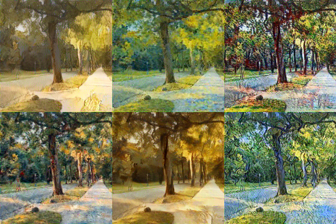
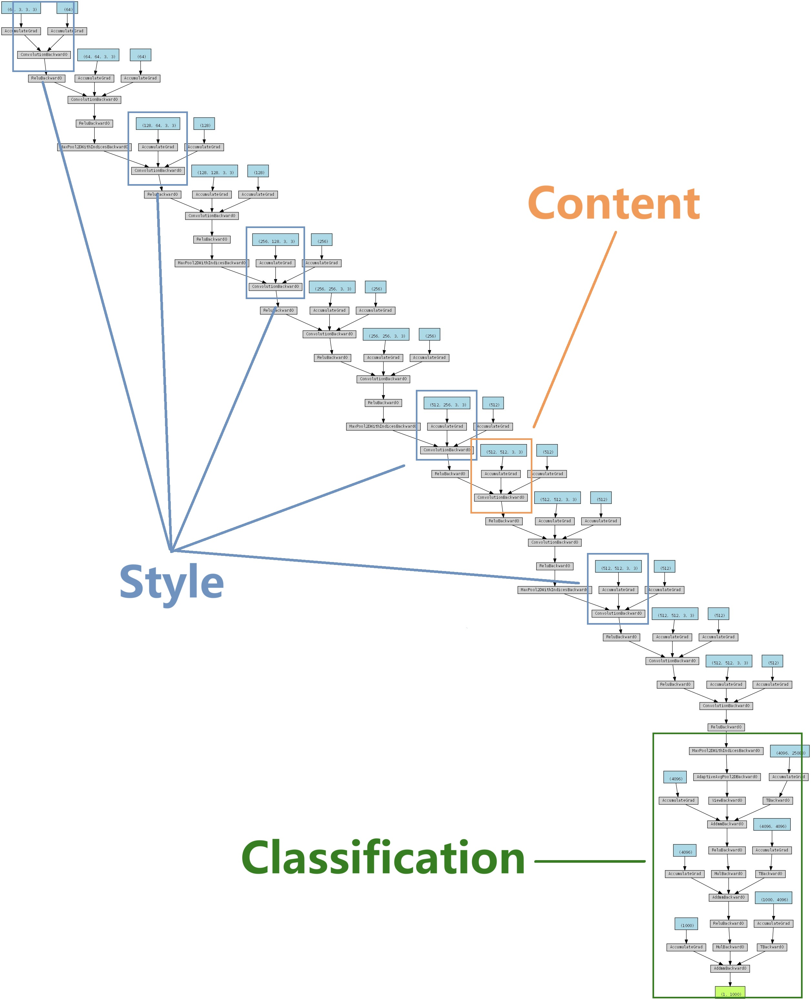
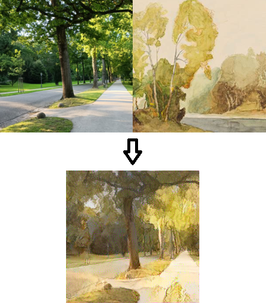

# Easy Style Transfer in PyTorch



This repository implements style transfer in PyTorch based on the paper "A Neural Algorithm of Artistic Style". Artists in row major order: William Russell Flint, unknown impressionism artist, Claude Monet, Pierre-Auguste Renoir, William Turner, Vincent van Gogh. The idea is simple and the implementation is brain-friendly.

## 0. Table of Contents
- [Algorithm](#1-Algorithm)
- [Installation](#2-Installation)

## 1. Algorithm
Style transfer algorithm is based on neural networks that already understand visual inputs. This project uses a trained vgg16 network, which can be easily deployed using `torchvision` library. The network looks like this: 



The network is basically CNN layers + MLP layers. The MLP layers are used for image classification, which we ignore in style transfer tasks. The main argument is that the network encodes image features inside its hidden states, including style. Given a style image $S$ and a target image $T$, we try to make the hidden features of $T$ to be close to $S$. This magically works.

As shown in the above figure, we choose several hidden layers to represent style features (blue boxes). They are the direct outputs of convolution cells. We first compute the **Gram matrix** of these tensors:

```Python
# transfer.py
def gram_matrix(feature: torch.Tensor):
    c, h, w = feature.size()
    features_reshaped = feature.view(c, h * w)
    gram = torch.mm(features_reshaped, features_reshaped.t())
    return gram.div(c * h * w)
```

Then, we compare the Gram matrices of $S$ and $T$ using MSE loss. However, we also need to make sure not to destroy $T$'s original content. This is done by taking other layers (orange box in figure) and compute MSE loss directly. To sum up, we aim to minimize:

\[\min_{\text{image }X} c_1 \times \sum_{\text{style layer } l}{MSE(Gram(S_l), Gram(X_l))} + c_2 \times \sum_{\text{content layer }l}{MSE(S_l, X_l)}\]

The algorithm becomes clear now. We first initialize tensor $X=T$, then compute the gradient of $X$ with respect to the above loss. By changing $X$ gradually with gradient descent, we transfer the style of $S$ into $X$.

## 2. Installation
The requirements are simple. First, we need `torch` and `torchvision` to get vgg16 and do back propagetion. We also use `PIL` to open and save images. The above network picture is created with `torchviz`, but it is optional.

The file tree looks like this:
```
│  config.py 
│  console.py
│  image.py
│  transfer.py
│  vgg.py
├─images
│  ├─style
│  │      <style images>
│  └─target
│         <target images>
├─results
│      <output images>
├─weights
│      <vgg16 weight (not in repository)>
```

`config.py` contains file paths and hyperparameters. `console.py` implements a small module to generate logs. `image.py` converts between images and PyTorch tensors. `transfer.py` is the main algorithm. `vgg.py` conducts an autopsy of vgg16 model and extracts the features.

To run the code, we first need to modify `config.py` to set up the experiment, then simply run 
```Bash
python transfer.py
```

It will first download the trained vgg16 model from PyTorch official repository and load its weights into my vgg16 model (same structure). Then, it will transfer the styles. The output looks like this:
```
[✓] initialize Manager
[✓] fetch vgg16 weights
[✓] load vgg16 weights
[✓] process style image ./images/style/flint.jpg
[✓] process target image ./images/target/tree.jpg
[✓] transfer style
[✓] save loss to ./results/loss.png
[✓] save processed style image to ./results/style.png
[✓] save processed original image to ./results/original.png
[✓] save target image to ./results/tree_flint.png
```

You can set the **DETAIL** option in configuration to see processed images and loss curve. 



> Die Lichtentaler Allee in Baden-Baden ist shöne.
